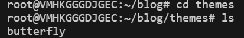

## 参考博客

### 参考1

地址如下

> https://baymrx.me/posts/946c99e6

界面如下：


> 那么已知框架是hexo，主题是butterfly


### 参考2

链接如下：

>https://www.cnblogs.com/wuhongbin/p/14318557.html

挺不错的静态博客

但是喔更喜欢第一个：使用了路由信息：至少让显示的不是html这么简单了


## 先看简单的成果


> 显示效果基本达到了：只看如何添加个人信息和文章了
>
> 文章效果也还不错：也算是动态路由了：虽然是静态页面

## 搭建hexo及其选择主题

### 官网

>https://hexo.io/zh-cn/

### 前置条件

- npm (核心)
- nodejs
- git

按照官网的几个基本步骤就行

```shell
npm install hexo-cli -g
hexo init blog
cd blog
npm install
hexo server
```

### 选择以及设置主题

从官网进入某个不错的主题界面：这里选择了butterfly

> https://github.com/jerryc127/hexo-theme-butterfly

#### 使用git进行下载

先确保自己当前pwd在blog下：也就是上面那个cd blog

```git
git clone -b master https://github.com/jerryc127/hexo-theme-butterfly.git themes/butterfly
```

#### 设置主题


见themes文件：git之后进去可见butterfly主题系统



打开blog下的_config.yml

找到theme:

将其内容填写为butterfly即可：具体如下：


然后主题就设置好咯


相关信息也可以在_config.yml中进行设置